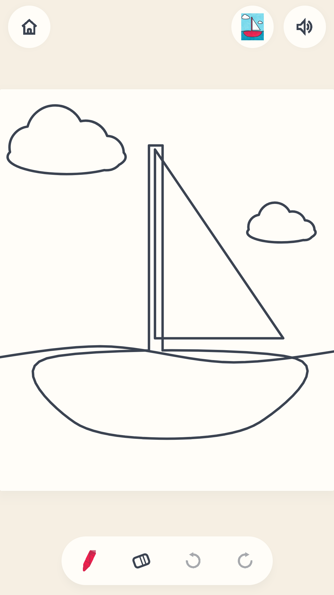
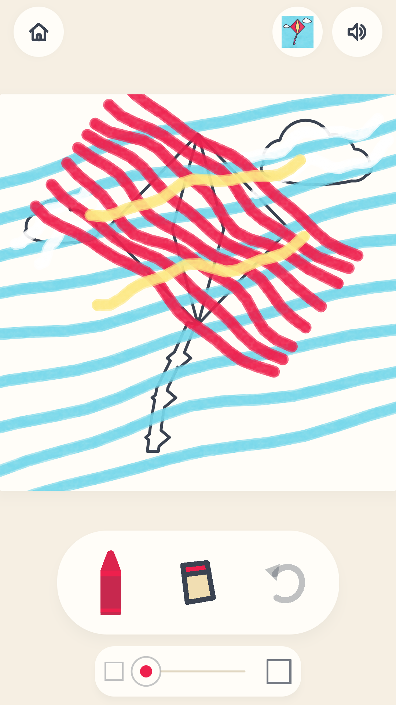
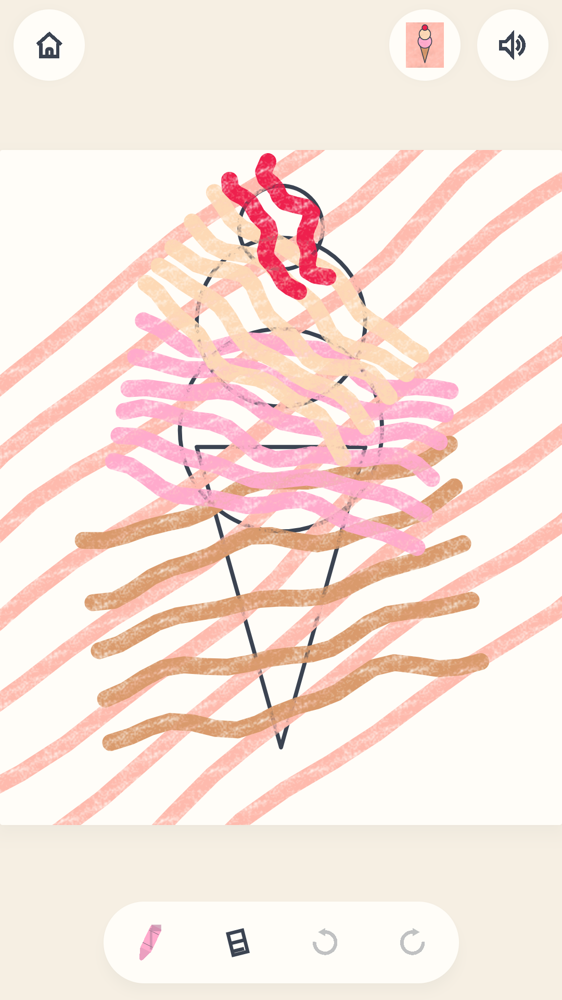

# Crayoner

A coloring book for small hands. A picture is shown in color, the same
picture is shown as bare outlines, and the child colors the outlines from a
tray of crayons until it matches. Built by a father for his children; on
Google Play so other families can use it too.

**Made for ages 3 to 5.** Paid once, and yours. Open source under MIT, and
the whole thing is in this repository.

- **Play Store package:** `io.github.muntasimulhaque.crayoner`
- **License:** MIT (free to use, read, fork and learn from)
- **Price:** paid once, no ads, no purchases, no subscriptions
- **Privacy policy:** [online](https://muntasimulhaque.github.io/crayoner/privacy.html) · [in this repo](docs/privacy.html)

<p align="center">
  
  
  
  
</p>

## What it is

Sixteen pictures, all of them there from the first launch. Tap one and the
page opens as bare outlines, with a capsule of the things a hand holds below
it and the finished picture in the top bar, a tap away.

| | |
|---|---|
| **The picture wall** | Every picture hung like a drawing on a wall, each leaning at a small angle of its own. Nothing on the wall is locked, stamped or marked: the pictures are all there from the first launch. |
| **A page** | A real sheet of paper lying on the desk, taller than it is wide the way a page in a coloring pad is, with the finished picture in the bar as one more round button: one tap holds it up large, one tap puts it back. |
| **The crayons** | One capsule holding the crayon in hand, the rubber, and a step back and forward, drawn on the same coins the top bar uses. Press the crayon and all thirty two colors of a real box open over the page, with the color in hand a little longer and drawn with a heavier line. Every area of every picture asks for a color that box holds. |
| **Coloring** | Your finger draws the crayon. Nothing is filled in for you: a mark follows your hand, lays down wax the way wax behaves, and covers the printed lines it is dragged over. |
| **The rubber** | Press it and your crayon becomes an eraser: it takes the wax off and leaves the printed line, exactly as a rubber does on paper. Nothing is ever wiped. |
| **Two steps** | Press undo and the last mark comes off the paper; press it again and the one before that comes off too, so a hand that drew three it did not mean gets all three back. Press redo beside it and the marks walk forward again, one a press, so looking at what you just did never costs you your work. A fresh page has nothing to walk either way and the press simply lands. |
| **Leaving a page** | Tapping Home in the middle of a picture asks one short question with two big answers: keep it just as it is, or start that one fresh. Either way nothing is lost by accident, and Back on the phone puts the question away and leaves every mark where it was. |
| **No score** | No progress bar, no timer, no stamp, no fail state, and nothing that measures the work. The app never decides that a picture is finished, because a coloring is finished when the child says so, and that is not the app's business. |

Every mark is saved a moment after it is finished, so a phone call, a
rotation or a killed app costs nothing. There is no score, no timer, no fail
state, and no picture is ever locked.

## Why parents pick it

- **Ages 3 to 5.** Sixteen pictures with five to eight big areas each, huge
  touch targets, and nothing that needs reading. Every screen fits any size
  of phone or tablet, held either way.
- **From an Islamic perspective.** No people, no animals, no faces, no
  mascots and no characters anywhere, in the pictures, the icon or the store
  art. Shape and color carry the warmth instead. No music and no pitch: the
  app makes one short, inharmonic rustle when a crayon or the rubber is
  picked up or put down, and is silent while the child colors.
- **Private by construction.** No ads, no trackers, no analytics, no
  accounts, no third-party SDKs and no internet access at all. The app
  declares zero permissions, so there is nothing for it to collect or send.
- **Built for TalkBack.** Every area of every picture is a named target with
  a spoken action, so the app works end to end without sight.
- **Paid once.** No purchase, no subscription, no unlock, no upsell. The
  source is on GitHub under the MIT license, so anyone can read exactly what
  the app does.

## Building

```
./gradlew :core:test :app:testReleaseUnitTest   # the rules
./gradlew :app:assembleRelease                  # R8 release
./gradlew :tools:makeSheets                     # every page, for review
./gradlew :tools:makeSounds                     # regenerate the sound effect
./gradlew :tools:makeIcons :tools:makeArt       # launcher icons and store art
```

An Android SDK and the Android Studio JBR are needed (`JAVA_HOME` must point
at the JBR; it is not on PATH).

Every push to `main` triggers GitHub Actions, which runs the tests, lint and
the asset pins, then builds a **signed release AAB and APK**. Signing uses
four repository secrets: `KEYSTORE_BASE64`, `KEYSTORE_PASSWORD`, `KEY_ALIAS`,
`KEY_PASSWORD`. The keystore is never committed; if it is lost, the app can
never be updated again.

A second workflow renders the Play Store screenshots on phone, 7" and 10"
emulators: seven scenes per form factor.

## Tech

Kotlin and Jetpack Compose. The pictures are **vector shapes drawn in code**,
not images, so one definition is crisp at any size and the sample, the page
and the wall card all draw the same data. Two renderers share that data:
Compose on the device, Java2D in the offline generators that produce the
review sheets, the icons and the store art. Both build a colored area out of
the same generated **wax** (core/Wax.kt): a surface of the crayon's own color
carrying the paper's tooth and the drag of the hand, with the passes of the
back and forth over it. That is what makes a fill read as crayon rather than
as paint, and the same tile generator paints the app's words.

```
core/     pure Kotlin, zero Android imports: shapes, geometry, the crayon
          box, the sixteen pages, the crayon's own shape, wax grain, and
          every rule about coloring
:app      host/ (ViewModel, DataStore, SoundPool) and ui/ (Compose)
:tools    offline generators: picture sheets, launcher icons, store art, sounds
```

The organizing principle: **the rules are pure data and functions; Android
is a player of those rules, not a participant.** A page is a list of areas,
an area is a list of shapes, and progress is the list of marks the child's
hand has made: each one a line with a color on it, or a line made with the
rubber. A page is a sheet of paper taller than it is wide, and its pictures
are fitted onto it from the square they are composed in, so the whole screen
is picture and nothing is stretched. That is why the whole coloring engine is
playable in plain JVM tests, and why the store screenshots render straight
from state.

See [AGENTS.md](AGENTS.md) for the working rules, the design decisions and
the lessons behind them.

## Privacy

Crayoner collects no data: no accounts, no analytics, no ads, no network
access, and no third-party SDKs of any kind. Because the app declares zero
permissions, there is nothing for it to collect. The only thing it keeps is
your own progress on your own device. The full policy is
[in this repo](docs/privacy.html) and
[hosted online](https://muntasimulhaque.github.io/crayoner/privacy.html).

## Store listing

The Play Store name, descriptions and the questionnaire answers live in
[play-store/play-store-submission-guide.md](play-store/play-store-submission-guide.md).
